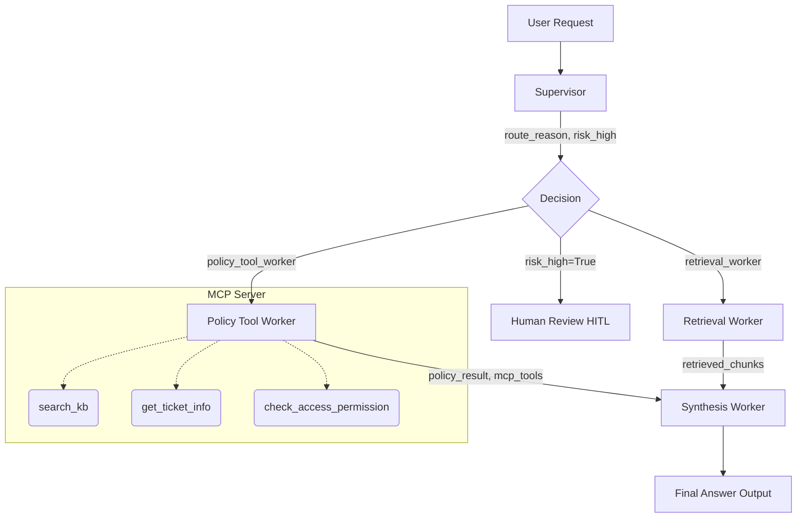

# System Architecture — Lab Day 09

**Nhóm:** DaoThang38  
**Ngày:** 10/06/2026  
**Version:** 1.0

---

## 1. Tổng quan kiến trúc

> Mô tả ngắn hệ thống của nhóm: chọn pattern gì, gồm những thành phần nào.

**Pattern đã chọn:** Supervisor-Worker  
**Lý do chọn pattern này (thay vì single agent):**
Kiến trúc này cho phép tách bạch rõ ràng khâu hiểu intent của người dùng (Supervisor) ra khỏi khâu thực thi chuyên sâu (Workers). Điều này giúp giảm rủi ro over-context cho LLM, dễ dàng gỡ lỗi từng phần (module isolation), và mở rộng (scale) thêm nhiều tính năng hay Agent mới mà không cần đập đi xây lại hệ thống.

---

## 2. Sơ đồ Pipeline

> Vẽ sơ đồ pipeline dưới dạng text, Mermaid diagram, hoặc ASCII art.
> Yêu cầu tối thiểu: thể hiện rõ luồng từ input → supervisor → workers → output.

**Sơ đồ thực tế của nhóm:**

---

## 3. Vai trò từng thành phần

### Supervisor (`graph.py`)

| Thuộc tính | Mô tả |
|-----------|-------|
| **Nhiệm vụ** | Tiếp nhận câu hỏi, phân tích từ khóa và điều hướng tới worker phù hợp. |
| **Input** | Câu hỏi của người dùng (task) |
| **Output** | `supervisor_route`, `route_reason`, `risk_high`, `needs_tool` |
| **Routing logic** | Sử dụng Heuristic Regex Pattern Matching và tra list từ khóa (`worker_contracts.yaml`). |
| **HITL condition** | Khớp với mã lỗi nghiêm trọng (vd: `ERR-`). Đặt `risk_high=True`. |

### Retrieval Worker (`workers/retrieval.py`)

| Thuộc tính | Mô tả |
|-----------|-------|
| **Nhiệm vụ** | Truy xuất các đoạn văn bản liên quan từ hệ thống ChromaDB. |
| **Embedding model** | `paraphrase-multilingual-MiniLM-L12-v2` |
| **Top-k** | 3 chunks |
| **Stateless?** | Yes |

### Policy Tool Worker (`workers/policy_tool.py`)

| Thuộc tính | Mô tả |
|-----------|-------|
| **Nhiệm vụ** | Kiểm tra quyền truy cập hoặc đối chiếu quy định (VD: Refund Exception) qua việc gọi các MCP Tool. |
| **MCP tools gọi** | `search_kb`, `get_ticket_info`, `check_access_permission`, `create_ticket` |
| **Exception cases xử lý** | Chính sách hoàn tiền Flash Sale, phân quyền Elevated Access Level 3/4. |

### Synthesis Worker (`workers/synthesis.py`)

| Thuộc tính | Mô tả |
|-----------|-------|
| **LLM model** | `gemini-2.5-flash` |
| **Temperature** | Mặc định của model (thấp) |
| **Grounding strategy** | Cung cấp prompt kết hợp toàn bộ context từ Worker trước đó (retrieval chunks hoặc policy_result). Bắt buộc trích dẫn nguồn. |
| **Abstain condition** | Khi context rỗng hoặc bị từ chối chính sách, trả lời không đủ thông tin hoặc theo chuẩn từ chối. |

### MCP Server (`mcp_server.py`)

| Tool | Input | Output |
|------|-------|--------|
| search_kb | query, top_k | chunks, sources |
| get_ticket_info | ticket_id | ticket details |
| check_access_permission | access_level, requester_role | can_grant, approvers |
| create_ticket | priority, title, description | ticket_id, status |

---

## 4. Shared State Schema

> Liệt kê các fields trong AgentState và ý nghĩa của từng field.

| Field | Type | Mô tả | Ai đọc/ghi |
|-------|------|-------|-----------|
| task | str | Câu hỏi đầu vào | supervisor đọc |
| supervisor_route | str | Worker được chọn | supervisor ghi |
| route_reason | str | Lý do route | supervisor ghi |
| retrieved_chunks | list | Evidence từ retrieval | retrieval ghi, synthesis đọc |
| policy_result | dict | Kết quả kiểm tra policy | policy_tool ghi, synthesis đọc |
| mcp_tools_used | list | Tool calls đã thực hiện | policy_tool ghi |
| final_answer | str | Câu trả lời cuối | synthesis ghi |
| confidence | float | Mức tin cậy | synthesis ghi |
| risk_high | bool | Cờ đánh dấu rủi ro cao | supervisor ghi, human_review đọc |
| needs_tool | bool | Cờ đánh dấu yêu cầu dùng MCP | supervisor ghi |
| hitl_triggered | bool | Trạng thái Human in the loop | human_review ghi |

---

## 5. Lý do chọn Supervisor-Worker so với Single Agent (Day 08)

| Tiêu chí | Single Agent (Day 08) | Supervisor-Worker (Day 09) |
|----------|----------------------|--------------------------|
| Debug khi sai | Khó — không rõ lỗi ở đâu | Dễ hơn — test từng worker độc lập |
| Thêm capability mới | Phải sửa toàn prompt | Thêm worker/MCP tool riêng |
| Routing visibility | Không có | Có route_reason trong trace |
| Security | Khó kiểm soát LLM bị prompt injection | An toàn, có chốt chặn HITL và Policy Tool |

**Nhóm điền thêm quan sát từ thực tế lab:**
Supervisor-worker hoạt động hiệu quả hơn rất nhiều ở khía cạnh ngăn ngừa Hallucination. Việc sử dụng Policy Worker và MCP Tools giúp hệ thống lấy được metadata thực tế thay vì buộc LLM phải nội suy từ các mảnh chunk rời rạc.

---

## 6. Giới hạn và điểm cần cải tiến

> Nhóm mô tả những điểm hạn chế của kiến trúc hiện tại.

1. Routing đang dựa trên Regex/Keyword nên vẫn cứng nhắc. Nếu gặp từ khóa đồng nghĩa (vd "trả lại tiền" thay vì "hoàn tiền") có thể bị lọt.
2. Quá trình chạy bị độ trễ nếu có nhiều MCP tools gọi liên tiếp do các tools thực thi đồng bộ. Cần tối ưu async/await cho các agent.
3. Không giữ context hội thoại (Stateless), nếu người dùng hỏi câu bám theo context trước đó (follow-up query), hệ thống sẽ không hiểu được ngữ cảnh.
