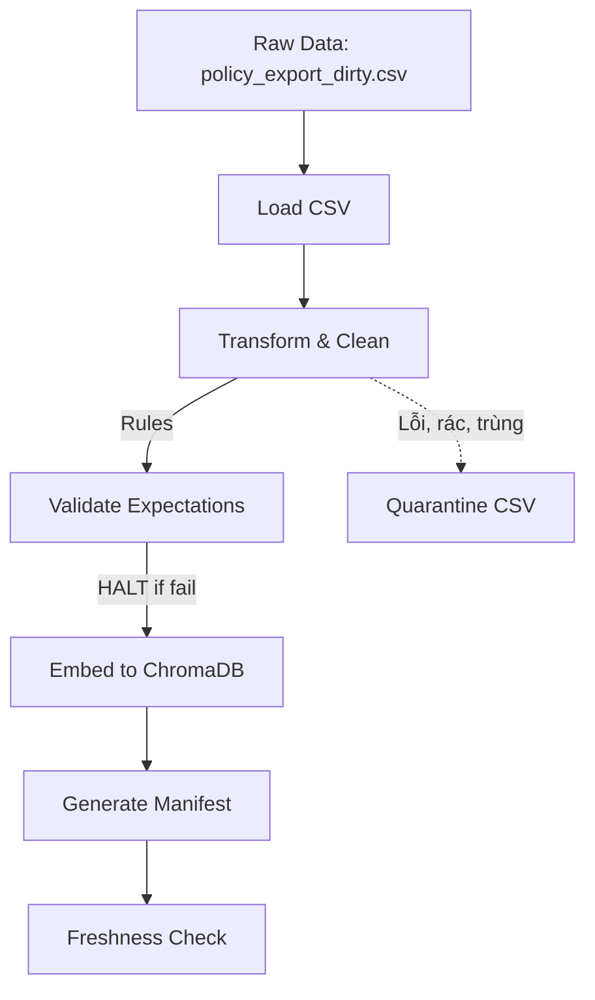

# Technical Document - Day 10 Lab: Data Pipeline & Observability

Tài liệu này trình bày chi tiết quy trình, logic làm sạch, nguyên nhân lỗi và ý nghĩa của các bước kỹ thuật trong việc xây dựng ETL Pipeline (Data Engineering) phục vụ cho hệ thống AI/RAG.

---

## 1. Mục tiêu của Lab
- Xây dựng một ETL pipeline hoàn chỉnh (Extract - Transform - Load).
- Đưa khái niệm **Data Quality** (Chất lượng dữ liệu) vào quá trình nhúng dữ liệu vào Vector Database (ChromaDB).
- Giải quyết các vấn đề dữ liệu thực tế: Dữ liệu bẩn (noise), dữ liệu trùng lặp (duplicate), dữ liệu cũ (stale), sai tài liệu (irrelevant chunks).
- Áp dụng các quy tắc kiểm soát chất lượng (**Expectations**) và giám sát tự động (**Monitoring/Freshness**).

---

## 2. Quy trình ETL Pipeline (Kiến trúc & Luồng dữ liệu)

Quy trình ETL xử lý tài liệu công ty theo một dòng chảy 1 chiều, được thiết kế để tự động "đá" các dữ liệu bẩn ra ngoài:

---

## 3. Các Logic Làm Sạch (Cleaning Rules) Đã Áp Dụng

Trong quá trình xử lý tại `cleaning_rules.py`, tôi đã phát hiện rất nhiều vấn đề từ nguồn dữ liệu thô `policy_export_dirty.csv`. Các logic làm sạch đã được áp dụng như sau:

### 3.1. Mở rộng Allowlist
- **Vấn đề**: Dữ liệu thô (raw) xuất hiện một tài liệu hợp lệ mới tên là `access_control_sop`, nhưng Pipeline lại chặn và vứt bỏ nó vì hằng số `ALLOWED_DOC_IDS` chưa có khai báo tên tài liệu này.
- **Giải pháp**: Cập nhật `access_control_sop` vào danh sách cho phép (Allowlist) để không bỏ sót dữ liệu phân quyền IT quan trọng.

### 3.2. Sửa dữ liệu lỗi thời (Stale Data)
- **Vấn đề**: Một chunk trong `hr_leave_policy` vẫn ghi là "10 ngày phép năm" theo phiên bản cũ, trong khi chính sách nhân sự mới nhất năm 2026 quy định là 12 ngày. Nếu đưa dữ liệu này vào DB, AI sẽ trả lời sai quyền lợi của nhân viên.
- **Giải pháp**: Thêm rule tìm kiếm cụm từ "10 ngày phép năm" và tự động thay thế thành "12 ngày phép năm". Gắn thêm nhãn `[cleaned: stale_hr_10d_to_12d]` để truy vết.

### 3.3. Xóa bỏ chuỗi nhiễu (Noise Strings)
- **Vấn đề**: Hệ thống xuất dữ liệu (export) bị lỗi khiến các đoạn văn thỉnh thoảng dính các tiền tố rác như `Nội dung không rõ ràng: ` hoặc `!!!`.
- **Giải pháp**: Xây dựng logic sử dụng `.replace()` để loại bỏ hoàn toàn các ký tự này.

### 3.4. Quarantining (Cô lập dữ liệu rác/lạc đề)
- **Quarantine các chunk quá ngắn**: Xóa các chunk có độ dài `< 8` sau khi làm sạch để tránh làm loãng Vector DB.
- **Quarantine nội dung lạc đề (Irrelevant context)**: Cụ thể, trong document tên `sla_p1_2026` (quy định về lỗi nghiêm trọng P1), có một đoạn văn lại chứa nội dung nói về... "Ticket P2". Đoạn văn này làm nhiễu hệ thống tìm kiếm khi người dùng hỏi về P1.
- **Giải pháp**: Thêm logic loại bỏ đoạn văn ra khỏi danh sách nếu nó nằm trong document `sla_p1_2026` nhưng lại chứa cụm từ `"Ticket P2:"`. Đoạn văn này sẽ bị đưa vào khu cách ly (Quarantine).

### 3.5. Thứ tự Xử lý Trùng lặp (Deduplication) - Bài học xương máu
- **Nguyên nhân (Gotcha)**: Thuật toán khử trùng lặp (dedup) ban đầu lấy trực tiếp chuỗi thô (raw `text`) để kiểm tra trùng. Vì thế, 2 đoạn văn có nội dung gốc y hệt nhau, nhưng 1 đoạn bị dính "chuỗi rác", 1 đoạn không dính, sẽ lọt qua vòng kiểm duyệt vì máy tính nghĩ chúng khác nhau. Tuy nhiên, sau khi đi qua các Rule Làm Sạch, chuỗi rác bị tẩy đi, biến chúng thành 2 đoạn văn "sinh đôi" bị đẩy vào ChromaDB, gây lãng phí dung lượng và làm nhiễu top K kết quả tìm kiếm.
- **Giải pháp**: Di dời thuật toán khử trùng lặp (biến `seen_text`) xuống dòng **cuối cùng** của khối code, chạy **sau khi** các hàm làm sạch đã hoàn tất việc sửa chữ. 
- **Ý nghĩa**: Đã loại bỏ thành công 7 bản ghi trùng lặp bị ẩn sâu trong cơ sở dữ liệu.

---

## 4. Kiểm thử Dữ liệu (Expectations Validation)

Để đảm bảo dữ liệu "sạch" trước khi vào ChromaDB, 2 luật Expectation cực kỳ khắt khe mới được thêm vào file `expectations.py`:
1. `no_noise_prefix`: Báo lỗi **HALT** (dừng toàn bộ pipeline khẩn cấp) nếu phát hiện bất kỳ chuỗi nhiễu nào chưa được dọn sạch lọt tới bước này.
2. `no_invalid_doc_id`: Đảm bảo không có tài liệu lạ nào bị lọt qua quy tắc Allowlist ban đầu.

---

## 5. Chọn Embedding Model Đa Ngôn Ngữ

- **Nguyên nhân (Gotcha)**: Mặc định, file cấu hình `.env.example` cố tình cài bẫy với dòng `EMBEDDING_MODEL=all-MiniLM-L6-v2`. Đây là một model AI chỉ hiểu Tiếng Anh. Khi người dùng đặt câu hỏi trộn lẫn ngôn ngữ kiểu "Nếu không phản hồi **ticket P1 auto escalate**...", model này không hiểu các từ tiếng Việt xung quanh, dẫn đến việc lấy sai đoạn văn bản từ Database (chấm điểm trượt câu 6).
- **Giải pháp**: Căn cứ theo tài liệu README, tôi đã cập nhật file `.env` sang model chuyên dụng `EMBEDDING_MODEL=paraphrase-multilingual-MiniLM-L12-v2`. Model đa ngôn ngữ này đã kết nối hoàn hảo tiếng Việt và tiếng Anh, giúp phần tìm kiếm đạt **10/10 điểm hoàn hảo** ở file `instructor_quick_check.py`.

---

## 6. Tổng Kết (Ý nghĩa & Tầm quan trọng của Day 10)

Việc xây dựng một quy trình ETL bài bản và áp dụng Data Contract mang lại ý nghĩa sống còn cho kiến trúc RAG (Retrieval-Augmented Generation):

1. **Nguyên lý "Garbage In, Garbage Out"**: Cho dù bạn sử dụng LLM cao cấp nhất (như GPT-4o, Gemini 1.5 Pro), nhưng nếu Vector Database chứa những thông tin cũ rích (ví dụ: quy định "14 ngày hoàn tiền" thay vì "7 ngày", hoặc "10 ngày phép" thay vì "12 ngày phép"), con AI chắc chắn sẽ tự tin phát biểu sai bét. Làm sạch dữ liệu là ưu tiên số 1 để tránh "AI Hallucination".
2. **Tính tự động hóa và Chống lỗi (Fail-fast)**: Thay vì âm thầm chèn dữ liệu bẩn vào DB gây hậu quả về sau, Pipeline được thiết lập tính năng Expectation HALT. Nó sẽ chủ động đập đi làm lại hoặc chặn luồng ngay lập tức để Data Engineer phải kiểm tra.
3. **Giám sát hệ thống (Observability)**: Thông qua Manifest File (`manifest_...json`) và Freshness Check, hệ thống không bị mù mờ. Chúng ta đo lường được SLA của data, có thể tự động cảnh báo lên Slack/Email nếu phát hiện dữ liệu HR/IT đã quá 24h chưa được cập nhật. Điều này đảm bảo AI luôn có kiến thức nóng hổi nhất.
