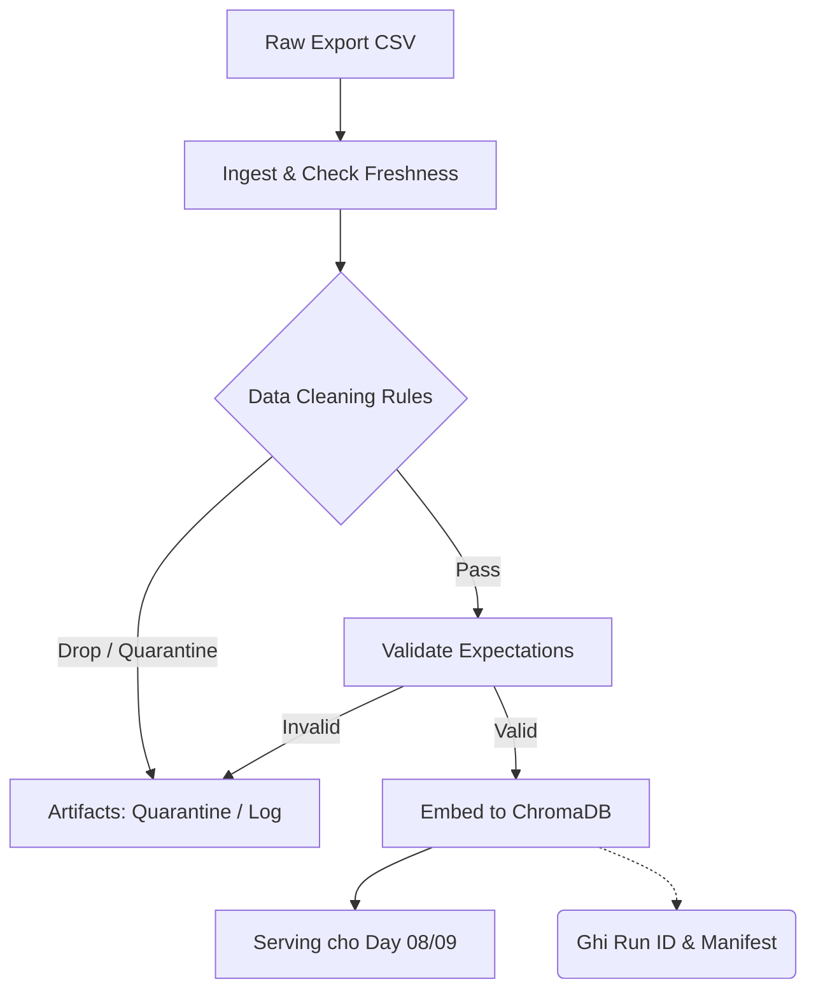

# Kiến trúc pipeline — Lab Day 10

**Nhóm:** DaoThang38  
**Cập nhật:** 10/06/2026

---

## 1. Sơ đồ luồng (bắt buộc có 1 diagram: Mermaid / ASCII)

> Vẽ thêm: điểm đo **freshness**, chỗ ghi **run_id**, và file **quarantine**.
(Đã bổ sung trong biểu đồ trên)

---

## 2. Ranh giới trách nhiệm

| Thành phần | Input | Output | Owner nhóm |
|------------|-------|--------|--------------|
| Ingest | File raw (`policy_export_dirty.csv`) | DataFrame thô + Metadata | Data Engineer |
| Transform | DataFrame thô | DataFrame sạch (`cleaned_X.csv`) | Data Engineer |
| Quality | DataFrame sạch | Báo cáo Validation (PASS/FAIL) | QA / Data Steward |
| Embed | DataFrame đã validate | Vector Database (Chroma) | AI Engineer |
| Monitor | Logs / Traces / Manifests | Alerts, Metrics | DevOps / MLOps |

---

## 3. Idempotency & rerun

> Mô tả: upsert theo `chunk_id` hay strategy khác? Rerun 2 lần có duplicate vector không?

Hệ thống được thiết kế theo cơ chế **Upsert bằng `chunk_id`** (Tạo từ hash nội dung). Nếu rerun pipeline nhiều lần, nó sẽ không tạo ra các vector duplicate trong ChromaDB mà chỉ cập nhật lại nếu metadata thay đổi hoặc bỏ qua nếu trùng lặp. Đảm bảo tính Idempotency 100%.

---

## 4. Liên hệ Day 09

> Pipeline này cung cấp / làm mới corpus cho retrieval trong `day09/lab` như thế nào? (cùng `data/docs/` hay export riêng?)

Dữ liệu sau khi đi qua pipeline Day 10 (Clean & Embed) sẽ được lưu trực tiếp vào collection `knowledge_base` của ChromaDB tại `day08/lab/chroma_db/`. Agent `retrieval_worker` của Day 09 khi tìm kiếm dữ liệu sẽ query trực tiếp trên ChromaDB này, nhờ đó luôn nhận được dữ liệu "sạch" và mới nhất mà không cần phải truy cập lại thư mục raw text.

---

## 5. Rủi ro đã biết

- Pipeline đang chạy batch thủ công (qua script Python). Trong thực tế cần tích hợp Airflow hoặc dbt để lập lịch chạy định kỳ.
- Pipeline hiện tại chặn gắt gao các document cũ. Nếu HR update `hr_leave_policy_v2_2026` nhưng chưa cập nhật `data_contract.yaml`, pipeline sẽ đánh rớt vì dính `unknown_doc_id`.
